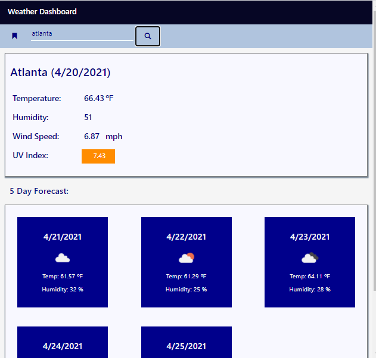
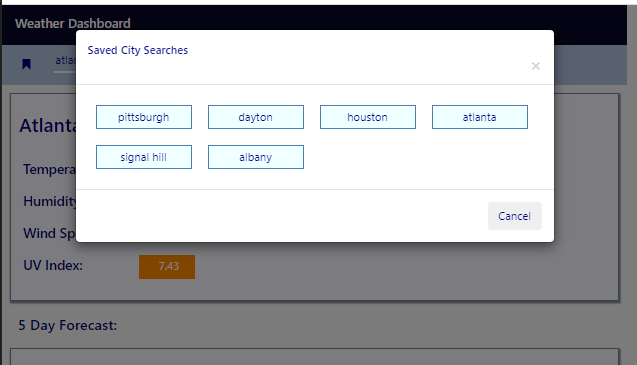

# Weather-Dashboard-App
a single page dashboard that allows users to search by location to generate a up-to-date dashboard with the weather forecast 

## Application Description
This application uses the OpenWeatherApi to display current weather and forecast details based on city searches entered by the user. It uses localstorage to save search values, so users can re-run items from a popup modal

## Application Notes
The main search function first calls the "2.5/weather?q=" endpoint to get current day values and coordinates for the city searched. It then makes a call to "2.5/onecall" with the lat an long as query string parameters to get weather details for the five day forecast dashboard. The app uses bootstrap, with flexbox for the thumbnails for mobile responsiveness.

## Link to Github Repository
https://github.com/geotecdev/Weather-Dashboard-App

## Link to Github pages site
https://geotecdev.github.io/weather-dashboard-app

App screenshots
dashboard

search history modal

License
Copyright (c) 2021 Mike Ruane (geotecdev)

Permission is hereby granted, free of charge, to any person obtaining a copy of this software and associated documentation files (the "Software"), to deal in the Software without restriction, including without limitation the rights to use, copy, modify, merge, publish, distribute, sublicense, and/or sell copies of the Software, and to permit persons to whom the Software is furnished to do so, subject to the following conditions:

The above copyright notice and this permission notice shall be included in all copies or substantial portions of the Software.

THE SOFTWARE IS PROVIDED "AS IS", WITHOUT WARRANTY OF ANY KIND, EXPRESS OR IMPLIED, INCLUDING BUT NOT LIMITED TO THE WARRANTIES OF MERCHANTABILITY, FITNESS FOR A PARTICULAR PURPOSE AND NONINFRINGEMENT. IN NO EVENT SHALL THE AUTHORS OR COPYRIGHT HOLDERS BE LIABLE FOR ANY CLAIM, DAMAGES OR OTHER LIABILITY, WHETHER IN AN ACTION OF CONTRACT, TORT OR OTHERWISE, ARISING FROM, OUT OF OR IN CONNECTION WITH THE SOFTWARE OR THE USE OR OTHER DEALINGS IN THE SOFTWARE.
